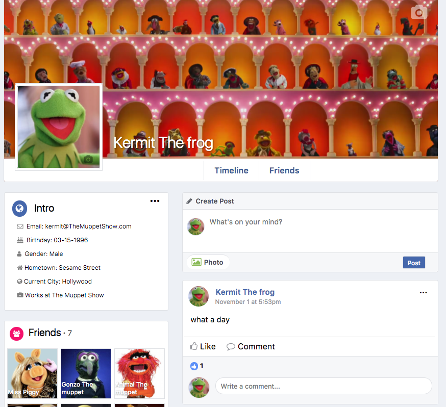
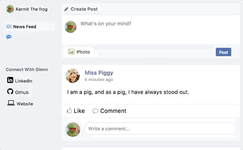

# farcebook
farcebook is a Facebook-inspired full-stack web application built upon a Rails framework. farcebook uses a PostgreSQL database and React for the rendering of frontend components, with Redux being used for state management.

[farcebook LIVE](https://farce--book.herokuapp.com)
# Features and Implementation

## Profile
Once a user signs up for an account, a profile page is created for them. Each profile includes a header that stores a profile picture and cover photo, an Intro section, which displays all of the current users information, a Friends section, which shows the users first 9 friends, and a feed that shows all of the posts posted by the user and posted to the users wall.

Photos are hosted using an AWS S3 bucket and upladed and stored into the database using the `paperclip` gem.

## Posts
Users share information with others through `Post` and `Comment` components. Posts can be posted directly onto another users wall or posted on their own wall (with the posts `receiver_id` being equal to their own `id`). Users are also able to upload an image to be shared along with each post.

Once created, posts can be both edited and deleted. An author can both edit and delete all of their posts, while the receiver of a post can only delete them.

To show approval, users can choose to `Like` a post. Posts show not only the number of likes received, but also the list of those users that liked it.

## Comments
Users can also leave comments onto posts. Comments are displayed in order based on when they were created. Comments can also be replied to with other comments, with each comment showing all of their nested comments. Comments are associated to other comments through an optional `parent_comment_id`.

Users can also choose to `Like` comments in the same fashion as posts. This is done using one table through the use of a polymorphic association, which uses a `likable_type` to store what kind of item is being liked.

## Notifications
A `Notification` is created and sent to another user when any user posts on their wall or any of their posts/comments are liked/commented on. This is once again achieved using a polymorphic associated that keeps track of which item is being notified on.

Users have a visual indicator on their navbar that shows whenever they have any new, unseen notifications and a dropdown that shows a list of all of their recent notifications. Each `NotificationListItem` shows the other users name and the action that took place, as well as links to the item in question when clicked on.

# Future Directions
- Messaging/Chat with other users
- Realtime Notifications/Chat using Pusher
- Albums for photos
